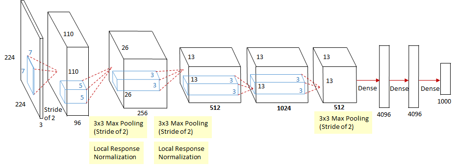

## ZFNet (Figure 3 in Zeiler and Fergus (2013)) Implementation
This repository is about ZFNet in Tensorflow 2.  
I used tf.keras.Model and tf.layers.Layer instead of tf.keras.models.Sequential.  
This allows us to customize and have full control of the model.  
I also used custom training instead of relying on the fit() function.  
In case we have very huge dataset, I applied online loading (by batch) instead of loading the data completely at the beginning. This will eventually not consume the memory.  
However, in case you prefer tf.keras.models.Sequential based models and loading the data completely in the beginning, then please refer to my repository: [ZFNet](https://github.com/Bao-Jiarong/ZFNet)  

#### The ZFNet Architecture
<p></p>
<center>

</center>

Figure 1: image is taken from [source](https://srdas.github.io/DLBook/ConvNets.html#ref-DBLP:journals/corr/ZeilerF13)   

<center>   
   
</center>

Figure 2: image is taken from [source](https://medium.com/coinmonks/paper-review-of-zfnet-the-winner-of-ilsvlc-2013-image-classification-d1a5a0c45103)   

### Training on MNIST
<p></p>
<center>

</center>

### Requirement
```
python==3.7.0
numpy==1.18.1
```
### How to use
Training & Prediction can be run as follows:    
`python train.py train`  
`python train.py predict img.png`  


### More information
* Please refer to the original paper of ZFNet [here](https://medium.com/coinmonks/paper-review-of-zfnet-the-winner-of-ilsvlc-2013-image-classification-d1a5a0c45103) for more information.

### Implementation Notes
* **Note 1**:   
Since datasets are somehow huge and painfully slow in training ,I decided to make number of filters variable. If you want to run it in your PC, you can reduce the number of filters into 32,16,8,4 or 2. (64 is by default). For example:  
`model = zfnet.ZFNet((113, 113, 3), classes = 10, filters = 8)`

* **Note 2** :   
You can also make the size of images smaller, so that it can be ran faster and doesn't take too much memories.

### Result for MNIST:   
* Learning rate = 0.0001  
* Batch size = 32  
* Optimizer = Adam   
* Filters = 8
* epochs = 2

Name |  Training Accuracy |  Validation Accuracy  |
:---: | :---: | :---:
ZFNet | 95.43% | 95.26%%
